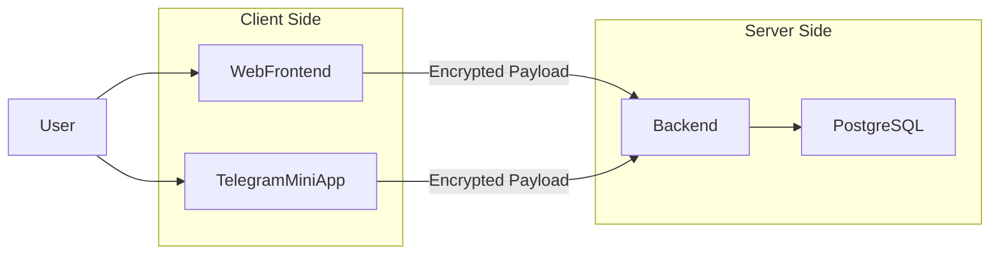

# Lockena

Lockena — персональный zero-knowledge менеджер паролей.

Проект реализован как полнофункциональный full-stack монорепозиторий и демонстрирует:

- Клиентское шифрование (AES-GCM)
- Derivation ключей через Argon2id
- Zero-knowledge архитектуру
- ASP.NET Core backend
- JWT + Refresh Token модель
- Telegram Mini-App интеграцию
- Docker-деплой всего стека

---

## Почему этот проект существует

Большинство менеджеров паролей:
- Требуют доверия к серверу
- Закрыты архитектурно
- Имеют дорогую подписку

Lockena реализует модель, при которой:

- Сервер не имеет доступа к мастер-паролю
- Сервер не может расшифровать пользовательские данные
- Вся криптография происходит на клиенте

Цель проекта — практическая реализация zero-knowledge архитектуры.

---

## Архитектура




### Архитектурный подход

- Клиентское шифрование перед отправкой на сервер
- Backend хранит только зашифрованные данные
- JWT-аутентификация (stateless)
- Refresh-токены с ограниченным сроком жизни
- Монорепо с изолированными приложениями
- Backend не участвует в дешифровании пользовательских данных.

---

## Структура монорепозитория
```
Lockena/
│
├── Lockena.Backend/       # ASP.NET Core 10 API
├── lockena-frontend/      # Web клиент (React + Vite)
├── lockena-miniapp/       # Telegram Mini-App (React + Vite)
├── nginx/                 # Reverse proxy конфигурация
├── docker-compose.yaml    # Оркестрация всего стека
└── README.md
```
Каждое приложение может собираться независимо.

---

## Технологии

### [Backend](./Lockena.Backend/README.md)
- ASP.NET Core 10
- Entity Framework Core
- PostgreSQL
- JWT + Refresh Tokens

### [Frontend](./lockena-frontend/README.md)
- React 19
- TypeScript
- Vite
- Zustand
- React Router
- TailwindCSS
- Axios
- libsodium-wrappers-sumo

### [Mini-App](./lockena-miniapp/README.md)
- React
- TypeScript
- Telegram WebApp API

### Infrastructure
- Docker
- Docker Compose
- NGINX

---

## Безопасность

### Модель шифрования
- AES-GCM для симметричного шифрования записей
- Шифрование выполняется на клиенте
- Сервер получает только encrypted payload

### Управление ключами
- Argon2id используется для derivation ключа
- На backend хранится только зашифрованный пользовательский ключ
- Дешифрование происходит исключительно на клиенте

### Аутентификация
- JWT access token — 15 минут
- Refresh token — 7 дней
- Stateless API
- TOTP пока не реализован

### Zero-Knowledge
Backend:
- Не хранит мастер-пароль
- Не может расшифровать пароли
- Не имеет доступа к ключам пользователя

---

## Запуск проекта

### Клонирование

```
git clone https://github.com/kindast/Lockena.git
cd Lockena
```

Переменные окружения для backend можно задать в `docker-compose.yaml`

| Переменная                           | Назначение                      |
| ------------------------------------ | ------------------------------- |
| JwtSettings__SecretKey               | Секрет для подписи JWT          |
| ConnectionStrings__DefaultConnection | Строка подключения к PostgreSQL |
| AllowedCorsOrigins | Разрешенные CORS домены через ; (например, `https://localhost:5173`) |
| TelegramBotToken             | Токен Telegram бота для мини-приложения |
| LogoDevApiKey | API ключ от сервиса [Logo.dev](https://logo.dev) для логотипов (можно оставить пустым) |

### Запуск через Docker Compose
```
docker-compose up --build
```

Поднимаются:
- Backend
- PostgreSQL
- Frontend
- Mini-App
- NGINX