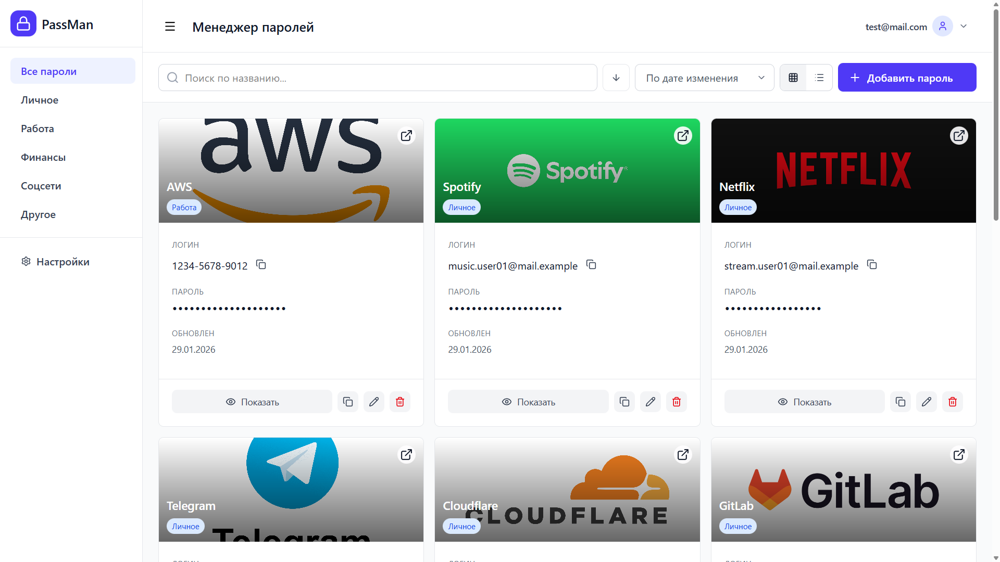

# Lockena Frontend

Web‑клиент для менеджера паролей **Lockena**.



---

## Стек

- React + TypeScript (Vite)
- Tailwind CSS для стилизации
- Axios для HTTP‑запросов к API
- Zustand для управления состоянием аутентификации
- Docker + Nginx для продакшн‑сборки и проксирования запросов к API

---

## Криптография

- libsodium-wrappers-sumo
- Argon2id для derivation
- AES-GCM для шифрования

Принципы:
- Мастер-пароль не сохраняется
- Ключ хранится только в памяти
- Шифрование выполняется перед API вызовом

---

## Возможности

- Регистрация и вход по email/паролю
- Авторизация через access‑токен в памяти и refresh‑токен в HttpOnly cookie
- Список сохранённых записей (логин/пароль)
- Создание, редактирование и удаление записей
- Поиск, сортировка по хранилищу и копирование паролей в буфер обмена

---

## Локальный запуск (без Docker)

### Предварительные требования

- Node.js 20+
- npm или pnpm
- Запущенный [Lockena.Backend](../Lockena.Backend/README.md)

### Шаги

1. Клонировать репозиторий:

```bash
git clone https://github.com/kindast/lockena-frontend.git
cd /Lockena/lockena-frontend
```

Установить зависимости:

```bash
npm install
```

или

```bash
pnpm install
```

Настроить переменную окружения API:

Создать .env или .env.local:
`VITE_API_URL=https://localhost:5000`

Запустить dev‑сервер:

```bash
npm run dev
```

Открыть приложение в браузере (обычно https://localhost:5173)

---

## Структура проекта

```
src/ ————————— основной код приложения
components/ —— UI‑компоненты
screens/ ————— страницы (логин, дашборд и т.д.)
services/ ———— работа с API (axios‑клиент, passwordService, authService)
store/ ——————— Zustand‑сторы (authStore)
crypto/ —————— функции шифрования и управления ключами
public/ —————— статические ресурсы (иконки, index.html)
```